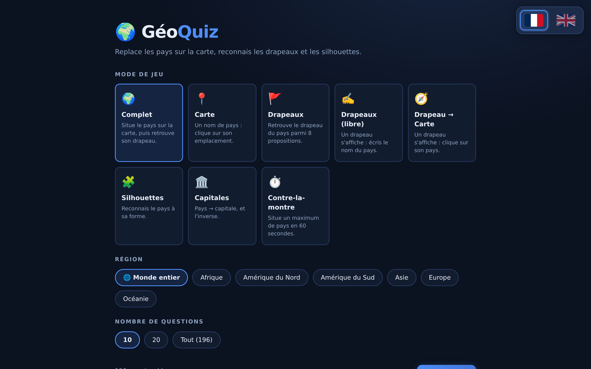
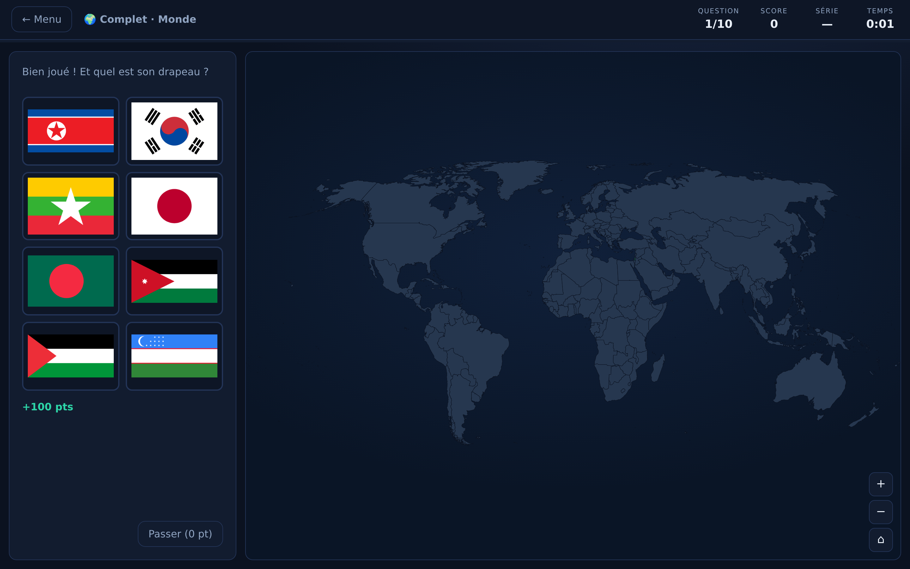
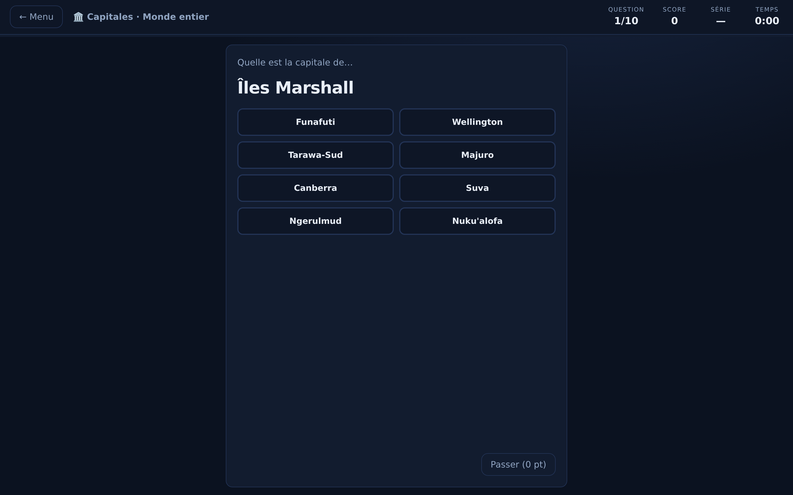
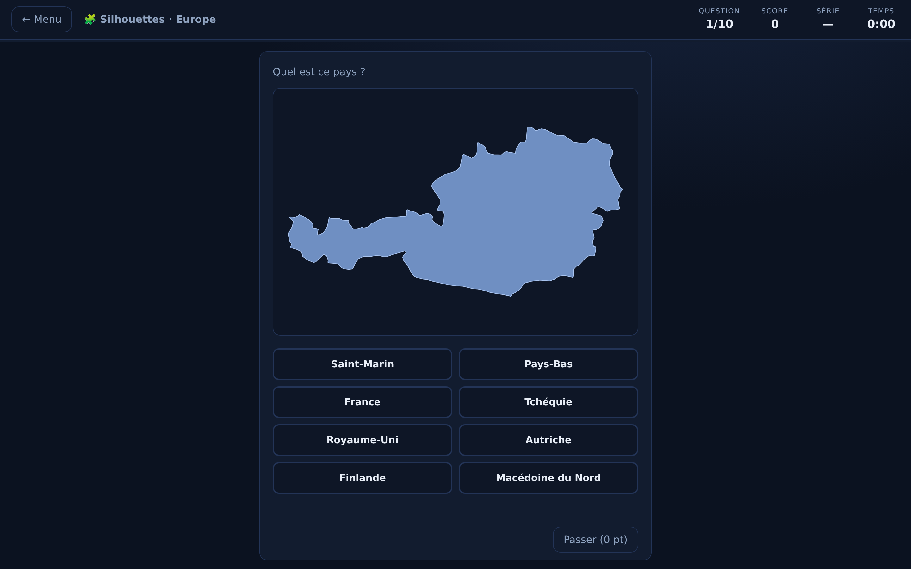

# 🌍 GéoQuiz

🇫🇷 Français | [🇬🇧 English](README.en.md)

**Apprends la géographie en jouant** : replace les pays sur la carte du monde, reconnais les drapeaux et les silhouettes. Interface bilingue 🇫🇷/🇬🇧 (switch en haut à droite, noms de pays traduits). 100 % statique (HTML/CSS/JS + D3), aucune dépendance serveur — hébergeable gratuitement sur GitHub Pages.



## 🎮 Modes de jeu

| Mode | Principe |
|---|---|
| 🌍 **Complet** | Un nom de pays s'affiche : clique sur son emplacement sur la carte, puis retrouve son drapeau parmi 8 propositions. |
| 📍 **Carte** | Nom → emplacement uniquement. |
| 🚩 **Drapeaux** | Nom → drapeau uniquement (8 propositions, distracteurs du même continent). |
| 🔤 **Drapeaux (à écrire)** | Un drapeau s'affiche : écris le nom du pays (saisie libre). |
| 🧭 **Drapeau → Carte** | Un drapeau s'affiche : clique sur le pays auquel il appartient. |
| 🧩 **Silhouettes** | La forme seule d'un pays s'affiche : retrouve son nom. |
| 🏛️ **Capitales** | Pays → capitale et capitale → pays (direction tirée au sort à chaque question). |
| ⏱️ **Contre-la-montre** | Situe un maximum de pays sur la carte en 60 secondes. |

Chaque mode se joue sur le **monde entier** ou par **continent** (Afrique, Amérique du Nord, Amérique du Sud, Asie, Europe, Océanie), avec 10, 20 ou toutes les questions (le contre-la-montre, lui, ne s'arrête qu'au chrono).





## 🏆 Score, chrono et records

- **Situer un pays** : 100 pts, −25 par mauvais clic (minimum 10). Le pays cliqué par erreur t'est indiqué — on apprend aussi de ses erreurs !
- **Drapeau en 2ᵉ étape** (mode complet) : 50 pts, −15 par erreur.
- **Question à choix** (drapeaux, silhouettes, capitales) : 100 pts, −25 par erreur.
- **Contre-la-montre** : le score = nombre de pays trouvés avant la fin des 60 s — pas de bonus, chaque seconde compte.
- **Saisie libre** : accents, majuscules, tirets et articles ignorés, fautes de frappe tolérées (1 lettre dès 5 caractères, 2 dès 10) et alias acceptés (« RDC », « Vatican », « Cap-Vert »…). Les noms français **et** anglais sont acceptés quelle que soit la langue de l'interface. Répondre un autre pays existant coûte −25 ; un mot inconnu ne pénalise pas.
- **Bonus temps** : jusqu'à +30 pts par question si tu réponds vite (chronomètre global affiché en continu).
- **Bonus série** 🔥 : +5 pts par question parfaite consécutive (plafonné à +25).
- **Passer** : révèle la réponse (zoom sur le pays), 0 pt, la série retombe.
- **Records personnels** par mode × région × nombre de questions (localStorage).
- **Rejouer mes erreurs** : en fin de partie, relance une session uniquement sur les pays manqués.



## 🚀 Lancer le jeu

Aucun build nécessaire :

```bash
# Option 1 : ouvrir directement index.html dans un navigateur
# Option 2 : petit serveur local
python3 -m http.server 8000   # puis http://localhost:8000
```

### Déployer sur GitHub Pages

1. Pousse le repo sur GitHub.
2. **Settings → Pages → Source : Deploy from a branch**, branche `main`, dossier `/ (root)`.
3. Le jeu est en ligne sur `https://<utilisateur>.github.io/GeoQuiz/`.

## 📱 Installer sur ton téléphone

GéoQuiz est une **PWA** (Progressive Web App) : pas d'APK ni de store, aucune
autorisation à accorder — il s'installe depuis le navigateur une fois le site
déployé (GitHub Pages ci-dessus, ou tout hébergement HTTPS).

1. Ouvre `https://<utilisateur>.github.io/GeoQuiz/` sur ton téléphone.
2. Un bouton **📲 Installer l'app** apparaît sur l'accueil. Sur Chrome, Edge et
   sur ordinateur, il ouvre directement la boîte de dialogue d'installation.
   Sur iPhone, Apple n'expose aucune API : le bouton affiche la marche à suivre
   (Partager → **Sur l'écran d'accueil**). Le bouton se masque tout seul si
   l'app est déjà installée ou si le navigateur ne sait pas le faire.
3. L'icône 🌍 apparaît comme une vraie app : plein écran, sans barre d'adresse,
   et **jouable hors-ligne** (tout est mis en cache par le service worker,
   drapeaux compris — ~3 Mo).

> Après une mise à jour du jeu, incrémente la constante `VERSION` dans `sw.js`.
> Les joueurs voient alors un bandeau **« ✨ Nouvelle version disponible »** :
> un tap et l'app se recharge à jour, sans rien vider à la main. Les versions
> antérieures à ce bandeau (`VERSION` < 7) sont rattrapées automatiquement par
> le service worker, qui recharge leur page à leur place.

## 🗂️ Architecture

```
index.html            Structure des 3 écrans (menu, jeu, fin de partie)
css/style.css         Thème sombre, responsive
js/map.js             Carte du monde D3 : rendu, zoom/pan, surbrillances, silhouettes
js/game.js            Logique de jeu : modes, scoring, chrono, déroulement
js/app.js             Menu, navigation, records (localStorage), enregistrement du SW
js/data/countries.js  197 pays (noms FR/EN, capitales, ISO, continent) — généré
js/data/world-topo.js TopoJSON Natural Earth 50m — généré
assets/flags/         250 drapeaux PNG (locaux : le jeu fonctionne hors-ligne)
assets/icons/         Icônes PWA — générées
manifest.webmanifest  Manifeste PWA (installation sur mobile)
sw.js                 Service worker : précache tout le jeu (hors-ligne)
tools/generate_data.py   Régénère les fichiers de données
tools/generate_icons.py  Régénère les icônes PWA
tests/e2e_smoke.py    Test de bout en bout (Playwright)
```

Vanilla JS assumé : pas de framework, pas de bundler — les données sont embarquées en `.js` pour que le jeu fonctionne même ouvert en `file://`.

### Régénérer les données

```bash
python3 tools/generate_data.py
```

Le pool = 193 membres de l'ONU + Vatican, Taïwan, Kosovo et Palestine (convention des quiz de géographie). Tuvalu, absent du fond de carte 50m, n'est proposé que dans les modes drapeaux.

### Tests

```bash
pip install playwright && playwright install chromium
python3 tests/e2e_smoke.py
```

## 🗺️ Roadmap

- [x] Mode **Capitales** (pays → capitale et inversement)
- [x] Mode **Contre-la-montre** (un maximum de pays en 60 s)
- [ ] Niveaux de difficulté (masquer les frontières, micro-États…)
- [ ] Sons et retours haptiques
- [x] PWA installable (hors-ligne, « Ajouter à l'écran d'accueil »)
- [x] Version anglaise (switch 🇫🇷/🇬🇧)

## 🙏 Données & crédits

- Frontières : [Natural Earth](https://www.naturalearthdata.com/) via [world-atlas](https://github.com/topojson/world-atlas) (domaine public)
- Métadonnées pays : [mledoze/countries](https://github.com/mledoze/countries) (ODbL)
- Drapeaux : [flagcdn.com](https://flagcdn.com/) (domaine public)
- Rendu carte : [D3.js](https://d3js.org/) (ISC)

## 📄 Licence

[PolyForm Noncommercial 1.0.0](LICENSE) — © Louis Tricoire.

Le code est librement consultable et réutilisable pour tout usage **non
commercial** (apprentissage, projets perso, éducation, recherche). Toute
utilisation commerciale nécessite l'accord préalable de l'auteur.
